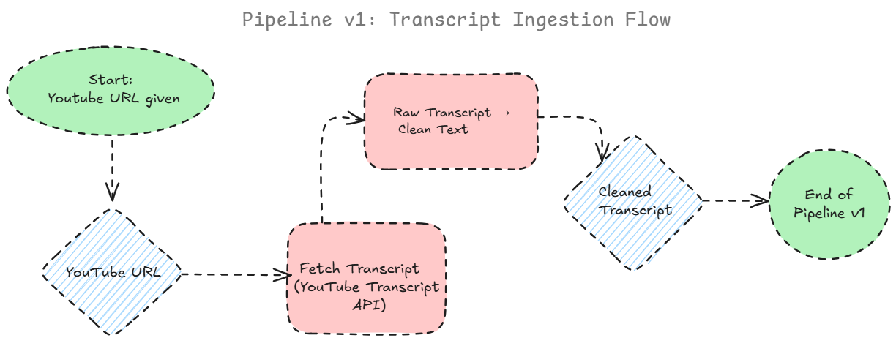
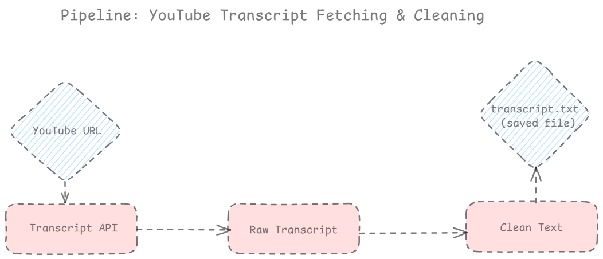

# YouTube Video Summarizer Agent 🎬

## Day 1 – Setup & Design

### Pipeline v1

YouTube URL → Transcript API → Raw Transcript → Clean Text

### Current Progress

- [x] Repo created
- [x] Folder structure
- [x] Installed dependencies
- [x] Pipeline v1 diagram

### Next Step (Day 2)

Learn and implement YouTube Transcript API integration.

## Day 2: Transcript Fetching & Cleaning

### Objective

- Fetch transcript from YouTube video using Transcript API
- Clean transcript text
- Save cleaned transcript to `transcript.txt`

### Pipeline Diagram

### Output

- `transcript.txt` containing the clean transcript

## Day 3: Transcript Summarization

**What was done today:**

- Loaded transcript from `transcript.txt`
- Used Groq LLM (`llama-3.1-8b-instant`) to summarize video
- Saved summary to `video_summary.txt`
- Learned how to use `.env` safely for API keys

**Next Steps:**

- Optional: Implement multi-language support
- Optional: Store summaries in a structured format (JSON/DB)

## Day 4

- Learned to integrate transcript summarization using Groq LLM.
- Implemented reading transcript from a local file.
- Saved the summary to a text file.

## Day 5

- Combined Day 4 functionality.
- Tested with different transcripts.
- Ensured API key is safely stored in `.env`.
- Generated bullet/paragraph summaries.
